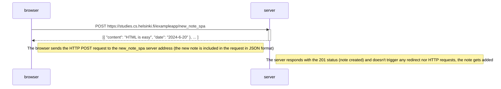

```mermaid
    sequenceDiagram
    
        browser->>server: POST https://studies.cs.helsinki.fi/exampleapp/new_note_spa
        activate server
        server-->>browser: [{ "content": "HTML is easy", "date": "2024-6-20" }, ... ]
        deactivate server
    
        Note right of browser: The browser sends the HTTP POST request to the new_note_spa server address (the new note is included in the request in JSON format)
        Note right of server: The server responds with the 201 status (note created) and doesn't trigger any redirect nor HTTP requests, the note gets added
```
